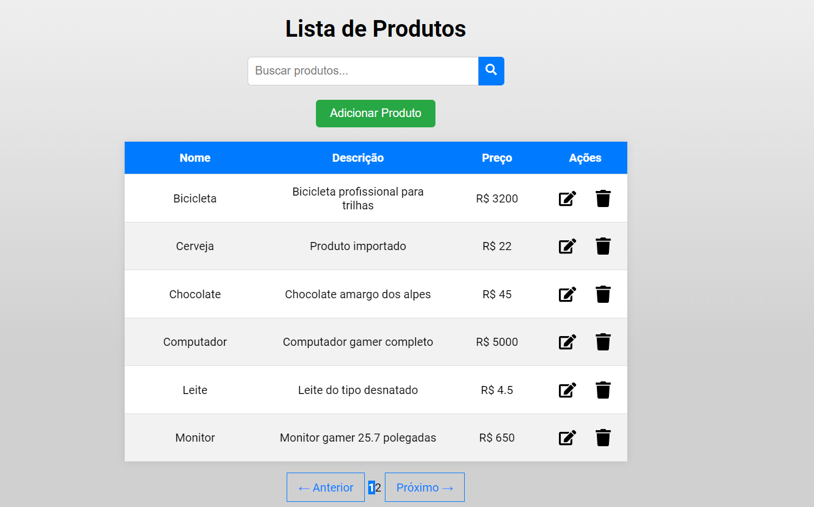
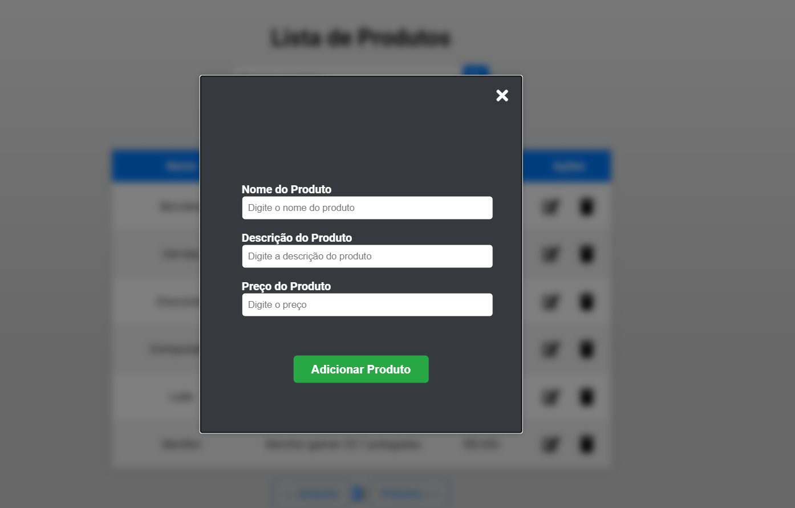

# 📦 Aplicação de Listagem de Produtos

## 📖 **Descrição do Projeto**

Aplicação de listagem e gerenciamento de produtos onde é permitido visualizar os produtos cadastrados, adicionar novos produtos, pesquisar, editar e excluir um produto.

## ✨ **Features**

- Tabela de produtos com paginação, sendo exibido 6 produtos por página.
- Pesquisa de produto pelo seu nome.
- Adicão de um novo produto
- Edição de um produto já existente.
- Exclusão de um produto.
- Modal para adicionar e editar produtos.

## 🚀 **Utilização**

### Visualizando Produtos

- A homepage exibe uma lista paginada de produtos.
- Use a barra de pesquisa para encontrar produtos específicos pelo nome.

### Adicionando um produto novo

- Clique no botão "Adicionar Produto".
- Preencha os dados do produto no modal que irá aparecer ao apertar no botão.
- Click "Save" to add the product to the list.
- Clique em "Adicionar" na modal para cadastrar um novo produto.

  

### Editando um produto

- Para Editar clique no icone de edição (🖉) do produto.
- Na modal que irá abrir atualize as informações do produto.
- Clique em "Editar" na modal para editar o produto escolhido.

### Deleting a Product

- Para Excluir clique no icone de edição (🖉) do produto.
- Confirme a exclusão no pop-up.

## 🧰 **Tecnologia Utilizadas**

- **Frontend:**
  - React
  - Axios
  - React Bootstrap
  - React Icons
  - React Paginate

- **Backend:**
  - Node.js
  - Express
  - Prisma

## 👥 **Contributing**

1. Fork the repository.
2. Create a new branch: `git checkout -b feature/your-feature`
3. Make your changes and commit them: `git commit -m 'Add some feature'`
4. Push to the branch: `git push origin feature/your-feature`
5. Open a pull request.

## 📄 **License**

This project is licensed under the MIT License. See the [LICENSE](LICENSE) file for details.

---

Developed with 💻 by [Henrique Mendonça](https://github.com/HenriqueGMen)
